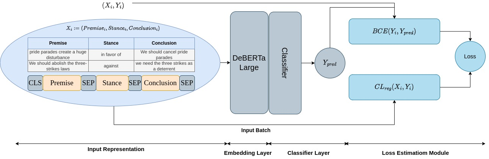

## T.M. Scanlon at [SemEval-2023 Task 4](https://touche.webis.de/semeval23/touche23-web/index.html): Leveraging Pretrained Language Models for Human Value Argument Mining with Contrastive Learning
*Milad Molazadeh Oskuee, Mostafa Rahgouy, Hamed Babaei Giglou, and Cheryl D Seals*



**Abstract**: Human values are of great concern to social sciences which refer to when people have different beliefs and priorities of what is generally worth striving for and how to do so. This paper presents an approach for human value argument mining using contrastive learning to leverage the isotropy of language models. We fine-tuned DeBERTa-Large in a multi-label classification fashion and achieved an F1 score of 49\% for the task, resulting in a rank of 11. Our proposed model provides a valuable tool for analyzing arguments related to human values and highlights the significance of leveraging the isotropy of large language models for identifying human values.

## Cite us as:

```bib
@inproceedings{molazadeh-oskuee-etal-2023-scanlon,
    title = "{T}.{M}. Scanlon at {S}em{E}val-2023 Task 4: Leveraging Pretrained Language Models for Human Value Argument Mining with Contrastive Learning",
    author = "Molazadeh Oskuee, Milad  and
      Rahgouy, Mostafa  and
      Babaei Giglou, Hamed  and
      D Seals, Cheryl",
    booktitle = "Proceedings of the The 17th International Workshop on Semantic Evaluation (SemEval-2023)",
    month = jul,
    year = "2023",
    address = "Toronto, Canada",
    publisher = "Association for Computational Linguistics",
    url = "https://aclanthology.org/2023.semeval-1.82",
    pages = "603--608"
}
```
